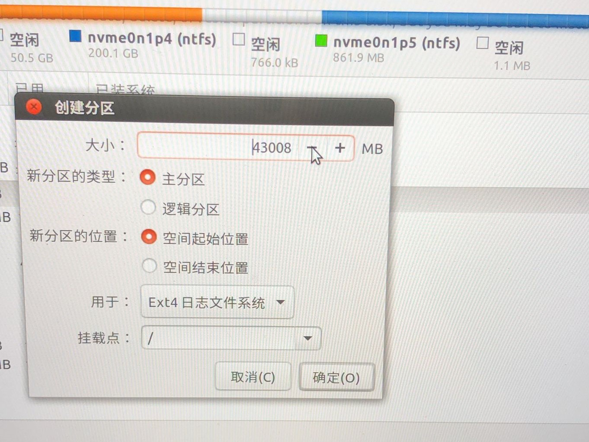
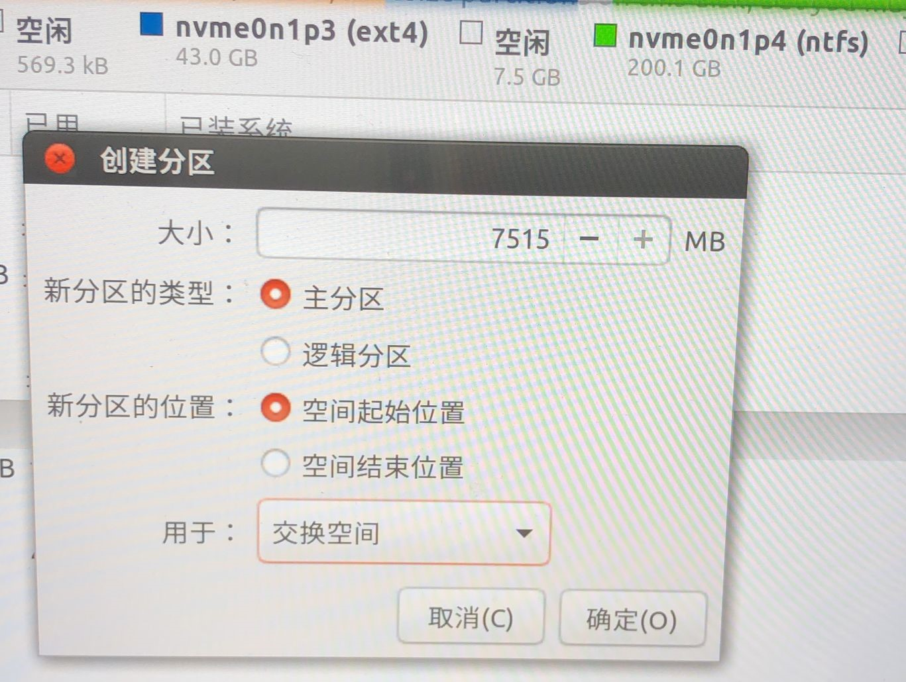

# 环境配置教程


*   本教程在匆忙中完成，必然有诸多疏漏。如有意见或建议，可以通过[issue](https://github.com/Sciroccogti/SEURoboCup2019Kidsize/issues)或者QQ群向我们提供反馈。
*   本教程有许多操作可以通过网上教程知悉，此处暂且不表，一律以“略”代替。详细图文教程尚在制作，预计会同赛题代码同时发布，稍安勿躁～
<!--Note:略的地方就是要讲的地方。赛题在昨天晚上已经发布了。-->


## Ubuntu 16.04安装

**！！数据无价，切记备份！！**

1. 您需要准备一个**不小于4GB的无用U盘（数据将会被清除！）**，一台在磁盘尾部有**不小于40GB空余空间的电脑**（内存应不少于8GB，有独显更好）。

2. [下载镜像](http://releases.ubuntu.com/16.04/ubuntu-16.04.6-desktop-amd64.iso)
> 请注意，镜像虽然实质是一个压缩包，但是不需要解压缩。

3. 为了给 *Ubuntu* 腾出40GB空间，您通常需要压缩磁盘卷。略。
Note:右键开始logo→磁盘管理

4. 烧写工具推荐使用[*Rufus*](https://rufus.ie/)。烧写时通常需要注意引导方式为UEFI。

5. 将U盘烧写为安装盘后，您需要重启电脑，将电脑设置为U盘启动。略。

6. 启动后，您需要在您之前腾出的不小于40GB的磁盘空间上安装 *Ubuntu 16.04*。此处可以参见[Linux公社教程](https://www.linuxidc.com/Linux/2016-04/130520.htm)。

***
以下操作十分危险，请慎重！

  * **请在选择 *安装类型* 时务必选择 *其它选项* ！！**多硬盘用户请注意启动项安装位置。

  * 进入其它选项后，选中您先前预留的磁盘空间，点击右下角的`+`号。如果您在分配该磁盘空间时不慎将其格式化为了NTFS等文件格式，此处请先点击`-`号。
  > 注意：`-`号意味着该磁盘空间上所有数据都将被清空！如果您不慎选错磁盘空间，请立即停止操作，不要点击`现在安装`，而是点击`退出`或`后退`，此时由于并未应用新的分区表，您的数据得以保留而未被格式化。
  
  * 在弹出的界面中，请将大部分空间`用于ext4`。我们建议您留一部分磁盘空间给 *交换空间* ，大小最好与您设备上的内存大小相近。选定`用于`和`大小`后，点击`确定`。`新的分区类型`并不重要，`新分区的位置`请保持默认为`空间起始位置`。
  
  
  
  * 如果您在上一步中决定为 *交换空间* 分配空间，那么您当前界面上应当仍有8GB左右空间未被分配。重复以上操作，但是`用于交换空间`。
  
  

只需一杯咖啡的时间，您的 *Ubuntu* 就已准备就绪😊。

安装完成后，您的电脑需要重新启动，并且通常会默认重启到全新安装的系统中。如果要切换启动项或者更改启动项顺序和默认启动项，请进入BIOS设置。略。

### 换源

进入全新安装的 *Ubuntu 16.04* 后，您通常需要更换源为国内源。该项操作推荐进入*软件和更新*中，在*下载自*下拉栏中选择*清华、阿里、华为*等镜像站，或者点击*选择最佳服务器*并等待一会。。


## ROS安装

该项操作请完全参照[官方教程](http://wiki.ros.org/kinetic/Installation/Ubuntu)并安装**ros-kinetic-desktop-full**（这很重要）。若下载过程中速度较慢，可能是因为您跳过了[换源](#换源)步骤。


## OpenCV安装

*OpenCV* 同样是本次竞赛必备的环境之一。但是您可能并没有在先前的介绍中注意到它，这是因为如果您在上一步中选择安装**ros-kinetic-desktop-full**，则 *OpenCV* 已经安装在您的系统中。

如果您并没有按照推荐安装**ros-kinetic-desktop-full**，则需要单独安装 *OpenCV*。略。


## Webots安装

Webots安装颇为简单。在[官方下载地址](https://github.com/omichel/webots/releases/download/R2019b/webots_2019b_amd64.deb)下载好`.deb`格式的安装包后，打开终端，进入下载文件夹，运行以下代码。系统可能会要求您输入您的密码。
```Bash
sudo dpkg -i webots_2019b_amd64.deb
```

> 由于近期外网环境处于特殊时期，普通用户下载速度可能受限，如果遇到技术问题，请移步[KidsizeQQ群](https://jq.qq.com/?_wv=1027&k=55BwToG)下载。
> 
> 如果您不知道终端是什么，您可能需要恶补Linux系统使用方法。为了表示友好，这里提示您终端的快捷键是`Ctrl+Alt+T`，或者在文件夹中右键。


## 其它

这里推荐使用 *Visual Studio Code* 浏览和编辑代码，[点击下载](https://az764295.vo.msecnd.net/stable/b37e54c98e1a74ba89e03073e5a3761284e3ffb0/code_1.38.1-1568209190_amd64.deb)。


## 谢谢~
